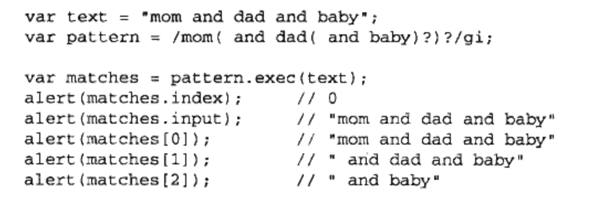

# 引用类型

**引用类型的值（对象）是引用类型的一个实例**。在ECMAScript中，引用类型是一种数据结构，用于将数据和功能组织在一起。它也常被称为类（Class），但这种称呼不妥当。尽管ECMAScript技术上是面向对象语言，但它不具备传统面向对象语言所支持的类和接口等基本结构。

新对象是使用new操作符后面加一个构造函数来创建的。构造函数本身是一个函数，只是函数是出于创建新对象的目的而定义的。，请看：

```js
var person = new Object();
```

这行代码创建了Object引用类型的一个实例，然后把该实例保存在变量person里。使用的构造函数时Object();它只为新对象定义了默认的属性和方法。ECMAScript提供了很多原生引用类型。

## Object类型

到目前为止，我们看到的大多数引用类型值都是Object类型的实例。

创建object实例的方式有两种：

* 使用new操作符后跟Object构造函数 var person = new Object(); person.name = 'sb';
* 使用对象字面量表示法, 是一种简写形势 var person = {name: 'sb'};

ECMAScript表达式上下文指的是能够返回一个值。最后一个属性定义的后面不加逗号，因为会在IE7等浏览器中报错。使用对象字面量法创建引用类型值时，属性名也可以使用字符串。  
在调用对象字面量定义对象时，实际上不会调用Object构造函数  
访问对象的属性可以通过点表示法或者方括号语法。方括号主要优点是可以使用变量来访问属性。  
牛逼的来了，person["first name"]是可以存在这样的带空格属性的，但是点语法访问不了，括号语法就行

## Array类型

数组，**数据的有序列表**，但与其他语言的数组不同，**ECMAScript数组的每一项可以保存任何类型的数据。**而且**ECMAScript的数组大小是可以动态调整的**，即可以随着数据的添加而自动增长以容纳新增数据。  
创建数组的基本方式有两种

* var colors = new Aarray(); 
  * 如果预先知道数组长度，也可以传递进去。var colors = new Array(20);
  * 也可以传递数组要包含的数据项 var colors = new Array('red', 'green')
  * 也可以省略new操作符 var colors = Array(5);
* 使用数组字面量表示法 var colors = ['red', 'blue', 'green'], 在数组字面量最后一位后面也加逗号的话，会引起BUG，在不同浏览器下数组长度不同，有的会加一个undefined（IE），有的只会有前几个元素。**与对象一样，调用数组字面量创建数组时也不会调用Array的构造函数**

读取或设置数组值时，要使用方括号并提供基于0的数字索引。查询的时候如果数字索引小于数组长度，则返回当前索引的数据，如果大于数组长度，返回undefined。如果是设置数组，索引小于数组长度，则修改数组，索引大于数组长度，则数组长度自动增长至索引+1，然后增加值，中间的全用undefined补齐。  
数组的长度保存在其length属性中，这个属性值始终会返回0或更大的值。**length不是只读的**，所以通过设置这个属性，可以从数组的末尾移除项或向数组中增加新项。  
也可以用这种沙雕方式在数组末尾添加新项，如person[person.length] = 'sb';

### 检测数组

使用 if (person instanceof Array) {}来判断是不是数组。但是这种方式的问题在于，如果一个网页包含多个框架（不太懂？），那实际上就会有多个不同版本的Array构造函数，如果从一个框架传入一个数组。那么传入的数组在第二个框架中就不能判断出来了。  
为解决instanceof的问题, ECMAScript5新增了Array.isArray()方法。

### 转换方法

如前所述，所有对象都有toLocaleString(), toString(). valueOf()方法。其中，调用数组的toString()方法会返回由数组中的每个值的字符串形势拼接而成的一个以逗号分隔的字符串。而调用valueOf返回的还是数组。实际上，为了创建这个字符串会调用数组中每一项的toString方法。

数组继承的toLocalString，toString，valueOf方法。在默认情况下都会以逗号分隔的字符串形式返回数组项。如果使用join方法，则可以使用不同的分隔符来创建字符串。join不传值或者传undefined，会按照逗号做分隔，IE低版本会使用undefined做分割😹

### 栈方法

ECMAScript数组也提供了一种让数组类似其他数据结构的方法。栈是LIFO（后进先出）的数据结构，数组专门提供了push 和 pop方法，来实现栈功能。

```js
var colors = new Array();
var count = colors.push('red', 'green');
alert(count);   // 2
count = colors.push('black');
alert(count)    // 3
var item = colors.pop();
alert(item);    // black
alert(colors.length)    // 2
```

由此可知，push是在数组最后一位增加值，pop是取走最后一位的数据，哪怕你最后操作的项是其他位置，pop也只取走最后一位的数据

### 队列方法

队列数据的访问规则是FIFO（先进先出）。也就是队列在数组末尾添加项，在数组头移除项。  
调用的模拟方法是push()最后一位插值，shift()返回第一位删除值。  
还有unshift()方法，用于向数组前端增加任意个项，并返回数组的新长度。也可以用unshift() 和 pop() 实现反向队列。  
IE7下unshift总会返回undefined而不会返回长度

### 重排序方法

数组中已经有两个可以用来重排序的方法：reverse和sort，reverse会反转数据项的顺序。  
但是reverse不太灵活，所以有了sort  
默认sort方法按升序排列数组项(从小到大)，为了实现排序，sort会调用每个数组项的toString方法，然后比较得到的字符串确定如何排序。即使数组里每项都是数值，sort也会调用toString。  
所以就使得sort不太好，所以sort函数接受比较函数作为参数，比较函数接收两个参数，如果第一个参数应该位于第二个参数之前就返回一个负数。如果两个参数相等则返回0，如果第一个参数应该位于第二个参数之后则返回一个正数。

### 操作方法

concat()方法可以基于当前数组中的所有项创建一个新数组。具体来说，这个方法会先创建当前数组的一个副本。然后将接收到的参数添加到这个副本的末尾，最后返回新构建的数组。在没有给concat方法传递参数的情况下，它只是复制当前数组并返回副本。如果传递给concat的是一或多个数组，则该方法会将这些数组中的每一项都添加到结果数组中。如果传递的是值不是数组，这些值就会简单的添加到结果数组的末尾。**原数组保持不变**

slice()方法能够基于当前数组中的一个或多个项创建一个新数组，slice方法可以接受一个或两个参数，就是要返回项的起始和结束项。在只有一个参数时，slice返回从该参数指定位置开始到当前数组末尾的所有项。如果有两个参数，该方法返回起始和结束位置之间的项，**但不包括结束位置的项**，**slice方法不会影响原始数组**

splice()方法：主要用途是向数组中部插入项。3种用法

* 删除：可以删除任意数量的项。只需指定2个参数：要删除的第一项的位置和要删除的项数。例如：splice(0,2)会删除数组中的前2项。
* 插入：可以向指定位置插入任意数量的项。只需提供3个参数：起始位置，0，要插入的项。如果要插入多个项，可以再插入第四，第五，以至任意多个项。
* 替换：向指定位置插入任意多个项。同时删除任意数量的项，只需指定3个数。起始位置，要删除的项数和要插入的任意数量的项。插入的项数不必与删除的项数相等。

splice方法始终会返回一个数组，该数组中包含从原始数组中删除的项，如果没删除，就返回一个空数组。

### 位置方法

ECMAScript5为数组添加了两个位置方法。indexOf()和lastIndexOf()。这两个方法都接收两个参数。要查找的项和表示查找起点位置的索引。indexOf从头往后查找，lastIndexOf是从末尾往前查找。两个方法都要返回查找的项在数组中的位置，没找到的情况下返回-1。在比较第一个参数与数组中的每一项时，会使用全等操作符。

### 迭代方法

ECMAScript5为数组定义了5个迭代方法。每个方法都接收两个参数：要在每一项上运行的函数和（可选的）运行该函数的作用域对象——影响this值。传入的这些方法中的函数都会接收3个参数：数组项的值，该项在数组中的位置和数组对象本身。根据方法不同，函数执行后的返回值可能会也可能不会影响所访问的返回值，这是5个迭代方法：

* every() 对数组每一项运行给定函数，如果函数对每一项都返回true，则返回true。
* filter() 对数组每一项运行给定函数，返回该函数会返回true的项组成的数组。
* forEach() 对数组每一项运行给定函数，无返回值
* map() 对数组每一项运行给定函数，返回每次调用的结果组成的数组。
* some() 对数组每一项运行给定函数，如果该函数对任一项返回true，则返回true。

以上方法都不会修改数组中包含的值

### 缩小方法

新增两个缩小数组的方法reduce和reduceRight，这两个方法都会迭代数组的所有项，然后构建一个最终返回的值。其中，reduce方法从数组的第一项开始，逐个遍历到最后，而reduceRight则从数组最后一项开始，向前遍历到第一项。  
这两个方法都接收两个参数：一个在每一个项上调用的函数和作为缩小基础的初始值。传入函数接收四个参数：前一个值，当前值，项的索引和当前数组对象。此函数返回的任何值都会作为第一个参数自动传给下一项。第一次迭代发生在数组的第二项上。

## Date类型

ES的Date类型是在Java的Date类基础上构建的，为此Date类型使用UTC 1970年1月1日0点开始经过的毫秒数来保存日期。在这种数据存储格式的条件下，Date可以精确到1970年1月1日到之后的285616年。

调用new Date()创建一个日期对象，当不传递参数时，新创建的对象自动获得当前的日期和时间。如果想根据特定的日期和时间创建日期对象，必须穿入该日期的毫秒数。为简化这一过程。Date提供两个方法：Date.parse()和Date.UTC()。  
其中parse方法接收一个表示日期的字符串参数。然后尝试根据这个字符串返回相应日期的毫秒数。没有规定字符串格式，所以通常是因地区而异。如果字符串不能表示日期，那么它会返回NaN。实际上，如果直接传了个字符串，Date内部也会调用一次parse方法  
Date。UTC() 也同样返回表示日期的毫秒数，它的参数分别是年，以0起头的月，日，时，分，秒，毫秒。年和月都是必填项。和parse一样。Date()函数也会模仿UTC函数，但是Date()的日期和时间都是基于本地时区而非GMT。  
Date.now() 返回当前时间的毫秒数。不支持此函数的也可以用+new Date();日期转成数值型会返回毫秒值。

### 继承的方法

Date类型也重写了toLocalString(), toString(), valueOf()的方法。

* toLocaleString() 按照浏览器设定的地区相适应的格式返回日期和时间
* toString() 返回带有时区信息的日期和时间。
* valueOf() 返回日期的毫秒值。

### 日期格式化方法

* toDateString() 以特定于实现的格式显示星期几，月，日和年
* toTimeStrng() 以特定于实现的格式显示时分秒和时区
* toLocaleDateString() 以特定于地区的格式显示星期几，月，日和年
* toLocaleTimeString() 以特定于实现的格式显示时分秒
* toUTCString() 以特定于实现的格式显示完整的UTC日期

### 日期，时间组件方法

妈的有好多，不写了

## RegExp类型

ECMAScript通过RegExp实现正则。  
var expression = /pattern/flags;

其中的模式pattern部分可以是任何简单或复杂的正则表达式。可以包含字符类，限定符，分组，向前查找及反向引用。每个正则都可以带一个或多个标志（flags）。有3个标志

* g 全局
* i 不区分大小写
* m 多行模式

除了通过上面的字面量形式创建，还可以调用构造函数。var pattern = new RegExp('pattern', 'flags');

### RegExp 实例属性

regexp的每个实例都有以下属性，通过这些属性可以取得有关模式的各种信息。

* global 是否设置了g
* ignoreCase 是否设置了i
* lastIndex 表示开始搜索下一个匹配项的字符位置。从0算起
* multiline 是否设置了m
* source 正则表达式的字符串表示，按照字面量形式返回。

### RegExp实例方法

主要方法exec(), 专门为捕获组而设计的。exec接受一个参数。既要应用模式的字符串，然后返回包含第一个匹配项信息的数组；或者在没有匹配项时返回null。返回的数组虽然是Array的实例，但包含两个额外的属性：index和input。其中，index表示匹配项在字符串中的位置。而input表示应用正则表达式的字符串。在数组中，第一项是与整个模式匹配的字符串，其他项是与模式中的捕获组匹配的字符串。



对于exec方法而言，加g，也只会每次返回一个匹配项。在不设置全局标志的情况下，在同一个字符串上多次调用exec将始终返回第一个匹配的。加上g之后呢每次都会继续往下查找匹配项。

第二个方法是test，接收一个字符串参数。在模式与参数匹配的情况下返回true，否则返回false。  
regexp实例继承的tolocalestring和toString方法都会返回正则的字面量。

### RegExp构造函数属性

* input     最近一次要匹配的字符串
* lastMatch 最近一次的匹配项
* lastParen 最近一次的捕获项
* leftContent input字符串中lastMatch之前的文本
* multiline 是否所有表达式都使用多行模式
* rightContent  input字符串中lastMatch之后的文本

### 模式的局限性

正则表达式还有一些不支持的特性

## Function 类型

函数实际上是对象哈哈哈。

每个函数都是Function类型的实例，而且都与其他引用类型一样具有属性和方法。由于函数是对象，因此函数名实际上是一个指向函数的指针。不会与某个函数绑定。可以通过三种方式定义函数

```js
function sb() {}
var sb = function() {}
var sb = new Function("", "", "")// 最后一个参数被视为函数体
```

函数是对象，函数名是指针，所以可以多个函数名对应一个函数

### 没有重载

原因很清楚，是因为函数名是指针，声明两个一样名字的函数，本质上是对函数名进行了两次赋值。

### 函数声明与函数表达式

解析器在向执行环境中加载数据时，对函数声明和函数表达式不是一起加载，而是先读取函数声明，使其在执行任何代码前可用（可访问）。至于函数表达式，必须等到解析器执行到它所在的代码行，才会真正被解释执行。  
也就是函数声明会被优先解析执行，提升到顶部。只在函数声明里能用。  
当使用变量var a = function() {}的形式时不会提升到顶部，运行会报错（实测不会报错，估计是因为变量提升的问题）

### 作为值得函数

因为ECMAScript中的函数名本身就是变量。所以函数也可以作为值来使用。也就是说：不只可以像传递参数一样把函数传递给另一个函数。而且可以将一个函数作为另一个函数的结果返回。

```js
function callsomefunction(somefunction, args) {
    return somefunction(args)
}
```

要访问函数指针而不执行函数的话，把后面的圆括号去掉就行

### 函数值内部属性

在函数内部有两个特殊的对象，arguments和this。arguments就是传入参数的类数组对象。这个对象还有一个callee属性，此属性是一个指针，指向拥有这个arguments的函数。  
callee基本用途就是给迭代解耦。严格模式下调用callee会报错。  
另一个特殊属性是this，this引用的是函数据以执行的环境对象——也可以说是this的值（当在网页全局环境调用函数时，this对象指向的是window，严格模式下是undefined）  
还有一个caller，这个属性中保存着调用当前函数的函数的引用，如果是全局环境调用当前函数，caller是null。严格模式下不能为caller赋值，否则会报错。

### 函数属性和方法

既然函数是对象，那么函数也会有自己的属性和方法。每个函数都包含两个属性。length和prototype。  
length属性表示函数希望接受的命名参数的个数。

对于ECMAScript中的引用类型而言，prototype是保存它们所有实例方法的真正所在。换句话说，诸如toString() valueOf(), toLocaleString()等方法其实都保存在prototype名下，只不过是通过各自对象的实例访问罢了。在创建自定义引用类型以及实现继承时，prototype的属性是非常重要的。在ES5中prototype属性不可枚举，所以for-in不可见。

每个函数都有两个非继承而来的方法，call和apply。用途是在特定作用域中调用函数，实际上等于设置函数体内this对象的值。
