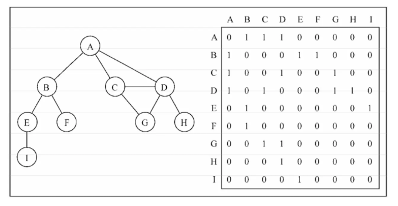

# 美团面试

## 还没去面试，先准备准备，贴一下面试要求

1. 扎实的计算机基础知识，熟悉常用数据结构与算法，并能在业务开发中灵活使用；
2. 熟悉JS/CSS3/HTML5等常用技术，能轻松写出符合W3C标准，兼容主流浏览器的代码；
3. 熟练使用主流前端框架至少一种，有实际项目经验，能够深刻剖析框架部分实现原理；
4. 对前端工程化有个人独到的见解，并有实际经验；
5. 对网站性能优化，浏览器端原理有个人独到见解；
6. 对HTTP有较深刻了解，熟悉Restful方式前后端交互流程；
7. 熟悉用户交互设计理论，热衷分析并改善产品的用户体验；
8. 能独立完成一个复杂模块或项目的开发工作，并与团队成员较好沟通协作；

具有以下资格者优先：

1. 熟悉前后端整体开发流程，能够从项目整体考虑设计方案，熟悉至少一种后端语言，Java/Python均可；
2. 熟练使用AngularJS/Vue框架中至少一种；
3. 熟练使用NodeJS；
4. 对组件化开发有深入理解；
5. 熟悉Linux，熟悉常用命令，了解Shell，Awk，Sed等使用；
6. 熟悉团队开发流程，熟练使用git工具进行代码管理；
7. 自我驱动，性格活泼开朗，活跃组内氛围；
8. 有开源作品或技术博客；

## 面试准备从哪点出发呢

看完JD之后心一凉，完蛋肯定要坏事，先评估一下自己的短处：

1. 不熟悉常用数据结构与算法，没有在业务中灵活应用过
2. 不能深刻剖析框架部分实现原理啊
3. 前端工程化，从滴滴那收了教训还没有学习
4. 网站性能优化，浏览器原理没有相关知识
5. HTTP, Restful方式 需补课

往好处看就是除了这5点，感觉都还行😜😜。从这里开始补课吧

理解proto和prototype
函数的__proto__ 指向Function的prototype

## 常用数据结构

### 栈

一种遵循先进后出原则的有序集合；新添加的或待删除的元素都保存在栈的末尾，俗称栈顶，另一端为栈底。在栈里，新元素都靠近栈顶，旧元素都靠近栈底。

### 队列

一种遵循先进先出原则的一组有序的项，队列在尾部添加新元素，从头部移除元素，最新添加的元素必须在队列末尾。  
**优先队列**: 把单个对象加上一个优先级的字段，包装成对象然后存到数组里，使用splice函数去在定位的顺序里存储对象。  
**循环队列**：搞不太懂，主要是实现一个当index大于数组长度length时，返回index/length的余数，根据余数再去数组里找余数对应的那个元素然后返回

### 链表

存储有序的元素集合。但不同于数组，链表中的元素在内存中并不是连续放置的；每个元素由一个存储元素本身的节点和一个指向下一个元素的引用（指针/链接）组成。  
链表相对于数组的优势在于添加或移除元素时无需操作其他元素，然而链表实现需要使用指针，因此在实现时要额外注意。劣势则在于数组可以直接访问任何中间位置的元素，链表则需要从第一个元素开始迭代列表直到找到所需的元素。

### 双向链表

单向链表只有next。也就是下一个元素的地址指向，而双向链表，每个元素都拥有上一个和下一个元素的指向。

### 循环链表

循环链表可以是单向也可以是双向，唯一的区别就是循环链表最后一个的next指向的不是null而是第一个元素。而且第一个的prev也是指向最后一个元素。

### 集合

由一组无序且唯一的项组成；这个数据结构使用了与有限集合相同的数学概念，但应用在计算机科学的数据结构中。

### 字典

以键值对为数据形态的数据结构，其中键名用来查找特定元素，类似于对象object。

### 散列

根据关键码值直接进行访问的数据结构。它通过把关键码值映射到表中一个位置来访问记录，以加快查找的速度；这个映射函数叫做散列函数，存放记录的数组叫做散列表。  
也就是大概使用一个函数来根据元素内容计算在数组里的位置，也就是key，然后查找时不用循环数组，只需要根据函数获取到位置key就拿到了。  
当散列表中的元素有冲突时，则需要解决冲突，使用的方法：分离链接，线性探查和双散列法。  
分离链接：大概是把元素存储，改成了在散列列表中存的是linkedList对象，然后根据key去数组里找对应的值  
线性探查：用数组index的形式记录，当这个位置上的数组，index==0时被占用了，就用index+1的位置，以此类推

### 树

由 n（n>=1）个有限节点组成一个具有层次关系的集合；把它叫做“树”是因为它看起来像一棵倒挂的树，也就是说它是根朝上，而叶朝下的，基本呈一对多关系，树也可以看做是图的特殊形式。

二叉树：二叉树中的节点最多只能有两个子节点：一个是左侧子节点，另一个是右侧子节点。  
二叉搜索树（BST）是二叉树的一种，但是它只允许你在左侧节点存储（比父节点）小的值， 在右侧节点存储（比父节点）大（或者等于）的值。  

### 树的遍历

中序遍历：中序遍历是一种以上行顺序访问 BST 所有节点的遍历方式，也就是以从最小到最大的顺序访 问所有节点。

```js
inOrderTraverse(callback) {
    const inOrderTraverseNode = (node, callback) => {
        if (node !== null) {
            // 一直优先左侧执行，才会导致是从小到大的顺序callback，BST的特性
            inOrderTraverseNode(node.left, callback)
            callback(node.key)
            inOrderTraverseNode(node.right, callback)
        }
    }
    inOrderTraverseNode(this.root, callback)
}
```

先序遍历：先序遍历是以优先于后代节点的顺序访问每个节点的。先序遍历的一种应用是打印一个结构化的文档。  

```js
preOrderTraverse(callback) {
    const preOrderTraverseNode = (node, callback) => {
        if (node !== null) {
            callback(node.key)
            preOrderTraverseNode(node.left, callback)
            preOrderTraverseNode(node.right, callback)
        }
    }
    preOrderTraverseNode(this.root, callback)
}
```

后续遍历：后序遍历则是先访问节点的后代节点，再访问节点本身。后序遍历的一种应用是计算一个目录和它的子目录中所有文件所占空间的大小。  

```js
postOrderTraverse(callback) {
    const postOrderTraverseNode = (node, callback) => {
        if (node !== null) {
            postOrderTraverseNode(node.left, callback)
            postOrderTraverseNode(node.right, callback)
            callback(node.key)
        }
    }
    postOrderTraverseNode(this.root, callback)
}
```

所以应对查找最小值，最大值和特定值的问题，用二叉树的中序遍历做最小值，后序遍历做最大值，先序遍历做特定值，好使

针对有可能生成树时左右不对称，现在特别有AVL树和红黑树的介绍：

### AVL树

AVL树是一种自平衡二叉搜索树，AVL树本质上是带了平衡功能的二叉查找树（二叉排序树，二叉搜索树），在AVL树中任何节点的两个子树的高度最大差别为一，也就是说这种树会在添加或移除节点时尽量试着成为一棵完全树，所以它也被称为高度平衡树。查找、插入和删除在平均和最坏情况下都是 O（log n），增加和删除可能需要通过一次或多次树旋转来重新平衡这个树。

### 红黑树

红黑树又叫RB-TREE（red-black-tree吧。。），是一种特殊的二叉查找树，红黑树的每个节点上都有存储位表示节点的颜色，可以是红或黑。  
红黑树有以下5个特性：

1. 每个节点都是红或者黑色
2. 根节点是黑色
3. 每个叶子节点（NIL），也就是为空的子节点，是黑色
4. 如果一个节点是红色的，那么它的子节点必须是黑色的
5. 从一个结点到该结点的子孙节点的所有路径上包含相同数目的黑色结点

红黑树的应用：主要用来存储有序数据，时间复杂度是$O(log^n)$, 效率还是很高的。JS的set是由红黑树实现的。（实际上Chrome V8的set是由hash实现的，时间复杂度是O(1)）

### 图

图是网络结构的抽象模型；图是一组由边连接的节点（顶点）；任何二元关系都可以用图来表示，常见的比如：道路图、关系图，呈多对多关系

邻接矩阵: 图最常见的实现是邻接矩阵。每个节点都和一个整数相关联，该整数将作为数组的索引。我 们用一个二维数组来表示顶点之间的连接。如果索引为 i 的节点和索引为 j 的节点相邻，则array[i][j] ===1，否则array[i][j] === 0,如下图所示：



## 常用算法

### 冒泡排序

冒泡排序比较任何两个相邻的项，如果第一个比第二个大，则交换它们。元素项向上移动至 正确的顺序，就好像气泡升至表面一样，冒泡排序因此得名。 

```js
Array.prototype.bubbleSort = function() {
    for (let i = 0; i < this.length; i++) {
        for (let j = 0; j < this.length - 1 - i; j++) {
            if (this[j] > this[j + 1]) {
                let aux = this[j]
                this[j] = this[j + 1]
                this[j + 1] = aux
            }
        }
    }
}
```

冒泡排序算法的复杂度是 O(n²), 不推荐使用

### 选择排序

选择排序算法是一种原址比较排序算法。选择排序算法的思路是：找到数据结构中的最小值并 将其放置在第一位，接着找到第二小的值并将其放在第二位，以此类推。

```js
Array.prototype.selectionSort = function() {
    let indexMin;
    for (let i = 0; i < this.length - 1; i++) {
        indexMin = i;
        for (var j = i; j < this.length; j++) {
            if (this[indexMin] > this[j]) indexMin = j;
        }
        if (i !== indexMin) {
            let temp = this[i];
            this[i] = this[indexMin];
            this[indexMin] = temp;
        }
    }
    return this;
}
```

### 插入排序

插人排序每次排一个数组项，以此方式构建最后的排序数组。假定第一项已经排序了，接着， 它和第二项进行比较，第二项是应该待在原位还是插到第一项之前呢？这样，头两项就已正确排 序，接着和第三项比较（它是该插人到第一、第二还是第三的位置呢？），以此类推。

```js
Array.prototype.insertionSort = function() {
    let j
    let temp
    for (let i = 1; i < this.length; i++) {
        j = i
        temp = this[i]
        while (j > 0 && this[j - 1] > temp) {
            this[j] = this[j - 1]
            j--
        }
        this[j] = temp
        console.log(this.join(', '))
    }
    return this
}
```

### 归并排序

归并排序是第一个可以被实际使用的排序算法。前三个排序算法性能不好，但归并排序性能不错，其复杂度为O(n log^n)。  
归并排序是一种分治算法。其思想是将原始数组切分成较小的数组，直到每个小数组只有一 个位置，接着将小数组归并成较大的数组，直到最后只有一个排序完毕的大数组。  

```js
Array.prototype.mergeSort = function() {
    function merge(left, right) {
        let il = 0, ir = 0;
        let result = [];
        while (il < left.length && ir < right.length) {
            if (left[il] < right[ir]) {
                result.push(left[il++])
            } else {
                result.push(right[ir++])
            }
        }
        while (il < left.length) {
            result.push(left[il++])
        }
        while (ir < right.length) {
            result.push(right[ir++])
        }
        return result
    }
    function mergeRes(arr) {
        if (arr.length === 1) return arr;
        const mid = Math.floor(arr.length / 2);
        const left = arr.slice(0, mid);
        const right = arr.slice(mid, arr.length)
        return merge(mergeRe(left), mergeRes(right))
    }
    return mergeRes(this)
}
```

### 快速排序

快速排序也许是最常用的排序算法了。它的复杂度为O(nlog^n)，且它的性能通常比其他的复杂度为O(nlog^n)的排序算法要好。和归并排序一样，快速排序也使用分治的方法，将原始数组分为较小的数组（但它没有像归并排序那样将它们分割开)。  
快排的基本过程：

1. 首先，从数组中选择中间一项作为主元
2. 创建两个指针，左边一个指向数组第一个项，右边一个指向数组最后一个项。移动左指 针直到我们找到一个比主元大的元素，接着，移动右指针直到找到一个比主元小的元素，然后交 换它们，重复这个过程，直到左指针超过了右指针。这个过程将使得比主元小的值都排在主元之 前，而比主元大的值都排在主元之后。这一步叫作划分操作。
3. 接着，算法对划分后的小数组（较主元小的值组成的子数组，以及较主元大的值组成的 子数组）重复之前的两个步骤，直至数组已完全排序。

```js
Array.prototype.quickSort = function() {
    let switchLR = (arr, left, right) => {
        let center = arr[Math.floor((left + right) / 2)];
        let i = left, j = right;
        while (i <= j) {
            while (arr[i] < center) {
                i++
            }
            while (arr[j] > center) {
                j--
            }
            if (i <= j) {
                let temp = arr[i];
                arr[i] = arr[j];
                arr[j] = temp;
                i++;
                j--;
            }
        }
        return i;
    }
    let quick = (arr, left, right) => {
        let index;
        if (arr.length > 1) {
            index = switchLR(arr, left, right);
            if (left < index - 1) {
                quick(arr, left, index - 1)
            }
            if (right > index) {
                quick(arr, index, right)
            }
        }
    }
    quick(this, 0, this.length - 1)
    return this;
}
```

### 顺序搜索

顺序或线性搜索是最基本的搜索算法。它的机制是，将每一个数据结构中的元素和我们要找的元素做比较。顺序搜索是最低效的一种搜索算法。

```js
Array.prototype.sequentialSearch = function(item) {
    for (let i = 0; i < this.length; i++) {
        if (item === this[i]) return i
    }
    return -1
}
```

### 二分搜索

这个算法要求被搜索的数据结构已排序，以下是该算法遵循的步骤
* 选择数组的中间值
* 如果选中值是待搜索值，算法执行完毕（值找到了）
* 如果待搜索值比选中值要小，则返回步骤1并在选中值左边的子数组中寻找
* 如果待搜索值比选中值要大，则返回步骤1并在选种值右边的子数组中寻找

```js
Array.prototype.binarySearch = function(item) {
    this.quickSort()    // 上来就是一个快排
    let low = 0
    let mid = null
    let element = null
    let high = this.length - 1
    while (low <= high){
        mid = Math.floor((low + high) / 2)
        element = this[mid]
        if (element < item) {
            low = mid + 1
        } else if (element > item) {
            high = mid - 1
        } else {
            return mid
        }
    }
    return -1
}
```

### 其他算法

贪心算法，动态规划

### 递归

递归就是我调我自己，总结起来难点就是在函数中实现一个循环（for或者while），然后校验条件，条件通过就return，碰到有子元素可迭代，就调用当前函数，把子元素传过去。拿返回值。

### 复杂的元素选择器

首先把元素选择器解析，拆成N个可单独执行的选择器  
再实现一个校验元素是否match的方法  
再实现一个校验相邻/下级/所有下级节点的校验方法
然后根据这俩方法去迭代查找出所有符合的dom元素。

### 重复值处理

双重循环查找 时间复杂度O(N^2)  
set(): let newArr = Array.from(new Set(oldArr)); 类似这样子吧
